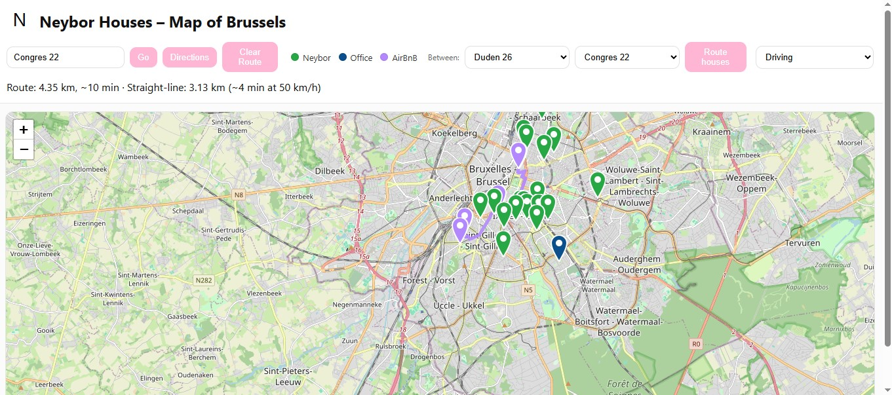

# Neybor Houses Map – Interactive Visualization with Flask and Leaflet



## 1. Introduction
The **Neybor Houses Map** is an interactive web application built to visualize all Neybor houses across Brussels.  
It enables users to explore, locate, and analyze Neybor’s housing network geographically through an intuitive interface.

The project uses **Python (Flask)** for the backend and **Leaflet.js** for the frontend map.  
It also integrates a **distance calculator** that computes straight-line distances between houses using GPS coordinates.

This tool was designed to support **property management, planning, and logistics optimization** within Neybor’s housing network.

---

## 2. Objectives
- Provide a clear geographic visualization of Neybor houses.  
- Facilitate search and filtering by house name or address.  
- Enable distance measurement between houses.  
- Offer a lightweight and easily deployable tool.

---

## 3. Key Features
- **Interactive Map:** Houses plotted using GPS coordinates.  
- **Search Function:** Locate houses by name or address.  
- **Distance Calculator:** Computes great-circle distances (in km).  
- **Dynamic API Endpoint:** `/data.json` returns house data in JSON format.  
- **Deployable Anywhere:** Includes Docker and Procfile support for easy hosting.  

---

## 4. Technology Stack
| Component | Technology |
|------------|-------------|
| Backend | Python (Flask) |
| Frontend | HTML, CSS, JavaScript |
| Mapping | Leaflet.js |
| Deployment | Docker / Gunicorn / Procfile |
| Data | Static Python file (`data.py`) |
| Testing | fetch_test.py (API test script) |

---


## 5. Project Structure

```
NeyborMap/
│
├── app.py # Flask server (serves pages + /data.json)
├── data.py # House dataset (name, address, lat, lon)
├── fetch_test.py # Script to test API and data endpoint
├── Dockerfile # Container configuration for deployment
├── Procfile # Process definition for Heroku-like deployment
│
├── templates/
│ └── index.html # UI (map + search + distance picker)
│
└── static/
└── leaflet/ # (Optional) Local Leaflet assets if CDN is blocked
├── leaflet.css
└── leaflet.js
│
└── maps.jpg # Screenshot preview of the map interface
```
---

## Installation

### Install Flask
```bash
pip install flask
```

### Step 2. (Optional) Download Leaflet locally

If your network blocks CDN links, download:

leaflet.css

leaflet.js

Place them inside:

static/leaflet/


Then update index.html to use:
```
<link rel="stylesheet" href="{{ url_for('static', filename='leaflet/leaflet.css') }}">
<script src="{{ url_for('static', filename='leaflet/leaflet.js') }}"></script>
```

### Step 3. Run the Application

From the project directory:
```
python app.py
```

Once the server starts, open:
```
http://127.0.0.1:5000
```
---
## 7. Using the Application
### 7.1 Viewing the Map

When the app is launched, the browser displays an interactive map centered on Brussels.
Each Neybor house is shown as a clickable marker that reveals the house name and address.

## 7.2 Searching for a House

A search bar allows users to type a house name or address.
The map automatically zooms to the selected house and opens its popup.

## 7.3 Calculating Distance Between Houses

A simple interface lets users select two houses from dropdown lists and calculate the straight-line distance (in kilometers) between them.
The calculation uses the Haversine formula, which approximates Earth’s curvature.
---
## 8. Distance Calculation Formula

The Haversine formula computes the great-circle distance between two points on a sphere using their latitudes and longitudes:

import math

def haversine(lat1, lon1, lat2, lon2):
    """
    Calculate the great-circle distance between two points on Earth (in km).
    """
    R = 6371  # Earth's radius in kilometers

    # Convert degrees to radians
    phi1, phi2 = math.radians(lat1), math.radians(lat2)
    d_phi = math.radians(lat2 - lat1)
    d_lambda = math.radians(lon2 - lon1)

    # Apply the Haversine formula
    a = math.sin(d_phi / 2) ** 2 + math.cos(phi1) * math.cos(phi2) * math.sin(d_lambda / 2) ** 2
    c = 2 * math.atan2(math.sqrt(a), math.sqrt(1 - a))

    distance = R * c
    return distance

# Example usage
house1 = (50.8268, 4.3368)  # Duden 26
house2 = (50.8343, 4.3544)  # Louise 32

print("Distance:", round(haversine(*house1, *house2), 2), "km")


This provides an accurate “as-the-crow-flies” distance, suitable for geographic visualization.
---
## 9. API Endpoints
Route	Description
/	Loads the interactive map
/data.json	Returns house data (name, address, lat, lon) in JSON format
/ping	Simple health check
/hello	Test endpoint for debugging

---
## Docker & Deployment

Run in Docker
```
docker build -t neybor-map .
docker run -p 5000:5000 neybor-map
```
Deploy to Heroku or Render

The included Procfile defines the Flask app entrypoint:
```
web: gunicorn app:app
```
11. Testing the API

Use the included fetch_test.py to verify that your /data.json endpoint is accessible:
```
python fetch_test.py
```
---
## 10. Privacy and Data Protection

Because the data represents residential addresses, special care must be taken before making it public:

Use approximate or anonymized addresses in data.py.

Randomize coordinates slightly (±0.001°) to prevent exact geolocation.

Keep real coordinates in a separate data_private.py file (excluded via .gitignore).

Example .gitignore entry:

data_private.py
__pycache__/
*.pyc
.env

---

## Privacy Notice:

The coordinates and addresses in this project are anonymized.
They represent approximate locations only and do not correspond to actual residences.
---

## 11. Troubleshooting

Issue	Cause	Solution
Blank map	Leaflet not loading	Use local static/leaflet files
No markers appear	Error loading /data.json	Check Flask console and JS console
ngrok error 502	Flask not running or wrong port	Run Flask first on port 5000
Incorrect distances	Wrong coordinate format	Verify lat/lon values in data.py
---
## 12. Future Enhancements

Integration of route drawing between houses.

Estimation of travel time using APIs (e.g., Google Maps).

Addition of house clusters by district or neighborhood.

Exporting distance matrices for operational use.
---
## 13. Author

Amel Ghribi (@Neybor)
Property & Operations Brussels, Belgium
---
## 14. License

This project is intended for internal use within Neybor.
If shared publicly, it may be released under an open-source license (such as MIT) provided that addresses and GPS coordinates are anonymized.
